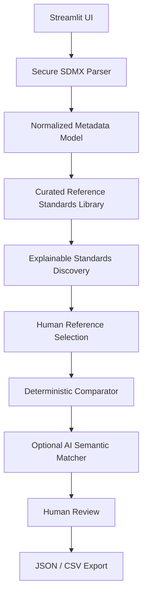

# AI-Assisted SDMX Standards Discovery, Alignment, and Validation Workbench

## MVP Blueprint

> Revised implementation baseline for a 1-2 day hackathon MVP. The product assists producers; it does not select an authoritative standard, certify compliance, or claim complete interoperability.

## Revision 2: Evidence-to-Artefact Vertical Slice

The implemented hackathon path extends discovery and assessment through a human-controlled transformation proof:

1. discover cited structural references and related methodology;
2. compare deterministically before optional AI semantic assistance;
3. record accept, modify-and-approve, reject, unresolved, and no-action decisions;
4. build a finalized typed change set;
5. transform a defensive XML copy using approved actions only;
6. run explicitly scoped MVP technical checks;
7. compare the revision against the same reference;
8. export revised XML, before/after evidence, JSON audit, and CSV change log.

The primary demo domain is Balance of Payments. `SDMXWS:DSD_BOP(1.0)` is identified as a workshop structural reference, while IMF BPM7/BPM6 are identified separately as methodological standards. AI does not generate XML, approve mappings, invent sources, or produce certification claims.

The authoritative implementation contract is `docs/superpowers/specs/2026-09-17-evidence-to-artefact-workbench-design.md`.

## 1. Executive Summary

The SDMX Standards Discovery and Alignment Assistant is a Streamlit application that helps a statistical producer discover potentially relevant SDMX reference standards and assess how a local Data Structure Definition (DSD) relates to one selected reference DSD.

The user uploads one local DSD. The application extracts its available metadata, searches a small curated Reference Standards Library, and presents up to five candidate reference DSDs with evidence explaining why each candidate may be relevant. The user, not the system, selects a reference. The application then performs deterministic structural and semantic comparisons, optionally asks an LLM to interpret unresolved relationships, and presents traceable findings for human review.

The primary output is an **SDMX Standards Discovery and Alignment Assessment**: evidence, proposed mappings, suggested actions, reviewer decisions, and provenance. It is not a compliance score, validation certificate, or automatic harmonization result.

## 2. Problem Statement

Producing technically valid SDMX does not guarantee that the resulting structure is semantically aligned or interoperable with structures used by other organizations.

Statistical producers face four practical problems:

1. They may not know which existing SDMX standard is relevant to a local DSD.
2. Searching registries, documentation, concept schemes, and codelists manually is time-consuming.
3. Similar IDs, labels, or structures do not necessarily represent the same statistical concept.
4. Differences may be legitimate local extensions, representation choices, metadata gaps, or genuine semantic conflicts rather than errors.

The MVP addresses the gap between SDMX syntax and producer-led semantic harmonization. It helps users discover plausible references, understand differences, and make documented decisions without pretending that software can determine statistical equivalence on its own.

## 3. Opportunity / Gap Addressed

The MVP addresses two connected opportunity areas.

### A. Standards Discovery

- Find potentially relevant reference DSDs before creating or restructuring local artefacts.
- Explain candidate relevance using concept, codelist, representation, and domain evidence.
- Make "No suitable reference standard identified." a valid result.

### B. Detailed Alignment Assessment

- Compare one local DSD with one user-selected reference DSD.
- Separate structural differences from semantic equivalence and conflict.
- Identify reusable artefacts, mappings, extensions, missing elements, and metadata gaps.
- Convert findings into human-reviewed actions with traceable evidence.

The solution supports reuse, modelling, codelist mapping, semantic interpretation, and evidence-based human review. It does not claim to cover the full SDMX lifecycle or the entire opportunity map.

## 4. Objectives

The MVP shall:

1. Accept one local SDMX-ML DSD as the starting point.
2. Extract and normalize available structural and semantic metadata.
3. Search a curated library containing a maximum of five reference DSDs.
4. Explain why each candidate reference was identified.
5. Let the producer select a reference or decline all candidates.
6. Compare the selected structures using deterministic evidence first.
7. Use AI only for unresolved semantic interpretation and explanation.
8. Distinguish alignment differences from errors and legitimate extensions.
9. Require human decisions for ambiguous or AI-assisted findings.
10. Export reviewed, versioned, and traceable results as JSON and CSV.

## 5. Scope

### In Scope

- One uploaded local DSD per browser session.
- A curated library of 3-5 reference DSDs maximum.
- Preferably at least two real, authoritative, versioned reference DSDs.
- Clearly labeled synthetic DSDs only for benchmark edge cases and offline demonstration.
- Discovery at DSD, concept, dimension, codelist, code, and representation level.
- Deterministic candidate discovery and detailed comparison.
- Optional OpenAI or Ollama semantic assistance.
- Human review and modification of proposed relationships.
- Category-level finding summaries without a single compliance score.
- JSON and CSV evidence export.
- Session-only state using `st.session_state`.

### MVP Constraints

- Python 3.11+ and Streamlit in one process.
- One selected reference DSD for detailed comparison at a time.
- XML uploads limited to 10 MB.
- No persistence of uploaded files, credentials, or review state after the session.
- A usable deterministic workflow must remain available without an LLM.

## 6. Out of Scope

The MVP shall not provide:

- full SDMX schema or business-rule validation;
- interoperability certification;
- regulatory or organizational compliance assessment;
- authoritative selection of a reference standard;
- a single alignment or compliance score;
- automatic acceptance of semantic mappings;
- automatic modification or publication of a DSD;
- a complete registry, governance platform, or approval workflow;
- observation-data transformation or validation;
- authentication, databases, production monitoring, or enterprise deployment;
- comprehensive coverage of all SDMX artefact types and versions.

## 7. Core User Flow

1. The producer uploads one local DSD XML file.
2. The application safely parses the file and reports whether it is parseable and supported by the MVP.
3. The parser extracts DSD identity, concepts, dimensions, codelists, codes, representations, labels, definitions, descriptions, annotations, and references when available.
4. The discovery engine compares the normalized local metadata with the curated Reference Standards Library.
5. The application shows up to five candidate reference DSDs and the evidence for each candidate.
6. The producer selects one candidate, browses the library manually, or chooses no reference.
7. The comparator performs a detailed deterministic assessment against the selected version.
8. Optional AI assistance examines only unresolved semantic candidates.
9. The application presents categorized findings, evidence, and proposed actions.
10. The producer accepts, rejects, modifies, marks unresolved, or marks no action required for reviewable findings.
11. The application produces a reviewed alignment assessment.
12. The producer exports JSON evidence and CSV findings.

The application must never automatically designate a candidate as authoritative or finalize a semantic mapping.

## 8. User Stories

- As a statistical producer, I want to upload my local DSD without already knowing which reference to compare it with.
- As a producer, I want candidate standards explained so I can judge their relevance.
- As an SDMX practitioner, I want the exact agency, artefact ID, and version displayed throughout the assessment.
- As a subject-matter expert, I want definitions and statistical context considered before two concepts are called equivalent.
- As a reviewer, I want to inspect deterministic and AI-assisted evidence separately.
- As a reviewer, I want to modify a proposed relationship rather than only accept or reject it.
- As a governance owner, I want every final recommendation linked to its source elements and reviewer decision.
- As an offline user, I want deterministic discovery and comparison to continue when no LLM is available.

## 9. Functional Requirements

### FR-01: Local DSD Intake

- Accept one SDMX-ML XML upload.
- Reject oversized files, DTDs, and external entity declarations.
- Show safe errors for malformed XML, absent DSDs, and unsupported structures.
- Describe the result as parseable/supported or not parseable/unsupported; do not claim complete SDMX validity.

### FR-02: Metadata Extraction

- Extract agency ID, artefact ID, version, name, description, concepts, dimensions, attributes, codelists, codes, representations, labels, definitions, annotations, and references when available.
- Preserve missing metadata explicitly rather than inventing values.
- Normalize metadata into provider-neutral internal models.

### FR-03: Standards Discovery

- Search only the curated library configured for the MVP.
- Use deterministic evidence before AI.
- Return no more than five candidates.
- Show exact evidence counts and matched element examples.
- Permit the result "No suitable reference standard identified."

### FR-04: Reference Selection

- Require explicit user selection before detailed assessment.
- Allow the user to decline all candidates or browse all library entries.
- Display the selected reference agency, ID, version, provenance, and retrieval date.

### FR-05: Detailed Assessment

- Compare concepts, dimensions, codelists, codes, representations, and metadata.
- Keep structural, semantic, representation, and metadata findings distinct.
- Produce explainable findings and proposed actions, not a single score.

### FR-06: Optional Semantic Assistance

- Send only unresolved, bounded metadata to the configured provider.
- Support OpenAI, Ollama, and no-LLM modes behind one interface.
- Preserve deterministic results when the provider is unavailable or returns invalid output.

### FR-07: Human Review

- Support Accept, Reject, Modify, Mark Unresolved, and Mark No Action Required.
- Allow a reviewer note for every reviewable finding.
- Never automatically finalize an AI-assisted mapping.

### FR-08: Export

- Export the complete assessment as JSON.
- Export a flattened findings and decisions table as CSV.
- Exclude credentials, authorization headers, and raw provider responses.

## 10. Reference Standards Library

The library is a small, curated collection rather than a live registry. Each entry shall record:

| Field | Requirement |
| --- | --- |
| Agency ID | Required |
| Artefact ID | Required |
| Version | Required |
| Name | Required |
| Description | Required when available |
| Domain / subject area | Required |
| Source / provenance | Required |
| Source URL or registry reference | Required when available |
| Retrieved or registered date | Required |
| Local library file | Required for offline demo |
| Fixture classification | `authoritative_reference` or `synthetic_benchmark` |

Library rules:

- Reference versions are immutable within a comparison session.
- The exact version used appears on discovery cards, assessment screens, and exports.
- Authoritative references must retain their original source and retrieval details.
- Synthetic artefacts must be visibly labeled and must not be presented as official standards.
- The MVP should include 3-5 diverse entries so discovery can demonstrate both plausible and unsuitable candidates.

## 11. Standards Discovery Logic

Discovery uses multiple explainable signals. It does not use an opaque overall AI ranking.

### Deterministic Signals

1. Exact concept ID overlap.
2. Exact normalized label or name overlap.
3. Concept scheme overlap.
4. Codelist identity or reference overlap.
5. Exact code-label overlap.
6. Dimension-role and structural similarity.
7. Representation similarity.
8. Domain or subject metadata overlap.

Each candidate result shall show evidence such as:

- 6 exact concept matches;
- 2 shared codelists;
- 4 similar dimension roles;
- 3 matching representations;
- shared labour-statistics domain metadata;
- 2 potential semantic correspondences requiring review.

Candidates may be ordered for usability using deterministic evidence tiers. The interface must state that ordering indicates discovery relevance, not correctness or authority. AI-derived semantic suggestions may supplement the explanation but must not silently determine the order.

If no candidate passes the minimum evidence rule, the application shall show **No suitable reference standard identified.** The user may still browse the library and manually select a reference.

## 12. Detailed Alignment Logic

The selected pair is assessed in this order:

1. Exact artefact and component identity.
2. Exact concept references and concept-scheme evidence.
3. Exact normalized labels supported by definitions and context.
4. Codelist and code-label relationships.
5. Representation and role differences.
6. Deterministic lexical candidates requiring review.
7. Optional AI interpretation of unresolved semantic candidates.
8. Unresolved or insufficient-metadata classification.

The assessment must distinguish:

- malformed or unsupported input from an alignment difference;
- structurally different but semantically equivalent concepts;
- similar labels with different statistical definitions;
- partial alignment;
- legitimate local extensions;
- elements present only in the reference;
- representation differences;
- genuine semantic conflicts;
- metadata too weak to support a conclusion.

`AGE` must not be classified as equivalent based on its ID or label alone. Definitions, age basis, unit, representation, codelist, and statistical context must be checked where available. If the evidence is inadequate, use `Insufficient Metadata`.

## 13. AI Requirements

AI is optional and limited to unresolved semantic interpretation and explanation.

AI shall not perform XML parsing, exact ID comparison, code equality checks, structural checks, or other deterministic operations.

Supported providers:

| Provider | Required configuration |
| --- | --- |
| No LLM | `LLM_PROVIDER=none` |
| OpenAI | `LLM_PROVIDER=openai`, `OPENAI_API_KEY`, `OPENAI_MODEL` |
| Ollama | `LLM_PROVIDER=ollama`, `OLLAMA_BASE_URL`, `OLLAMA_MODEL` |

The provider-neutral response must include:

- proposed relationship;
- matching method;
- evidence considered;
- concise explanation;
- similarity/confidence indicator when supplied;
- limitations or missing evidence;
- `requires_human_review=true`.

Every AI result must display: **AI-assisted suggestion - expert validation required.** Any confidence value is a matching signal, not a statistically calibrated probability.

## 14. Trustworthiness and Human Oversight

- Deterministic evidence is produced and retained before any AI call.
- Only unresolved metadata fields may be sent to an LLM.
- The application displays which fields were used by the model.
- Invalid, unparseable, or out-of-contract AI output is discarded safely.
- Provider failures leave candidates unresolved and do not interrupt deterministic processing.
- AI suggestions are never included in a finalized plan without a recorded human decision.
- The reviewer can Accept, Reject, Modify, Mark Unresolved, or Mark No Action Required.
- Modified relationships retain both the original proposal and the reviewer-approved value.
- Reviewer identity or initials, timestamp, decision, and note are included in exports.

## 15. Finding Classification

The primary output is a set of findings grouped by category. Category summaries are counts and evidence, not scores.

| Status | Meaning |
| --- | --- |
| Exact Alignment | Strong deterministic identity and compatible supporting metadata |
| Equivalent | Different identifiers or representation, but reviewed evidence supports equivalent meaning |
| Partial Alignment | Some meaning or coverage overlaps, but important differences remain |
| Mapping Required | Concepts align but values or codes require an explicit mapping |
| Representation Difference | Meaning may align while datatype, format, role, or representation differs |
| Local Extension | A local element has no reference counterpart and is judged legitimate |
| Reference-Only Element | An element exists only in the selected reference |
| Metadata Gap | Expected descriptive metadata is absent or incomplete |
| Potential Semantic Correspondence | Evidence suggests a relationship that requires expert review |
| Potential Semantic Conflict | Similar surface evidence masks a possible difference in statistical meaning |
| Insufficient Metadata | Available evidence cannot support a reliable relationship |
| Unresolved | The relationship remains undecided after available checks and review |

Review state is separate from finding status. `No Action Required` is a reviewer decision used when an intentional difference is acceptable.

Category-level result panels shall include:

- Structural Alignment;
- Concept Alignment;
- Codelist Alignment;
- Representation Alignment;
- Metadata Completeness.

No panel shall be combined into a single compliance or alignment score.

## 16. Actionable Recommendation Logic

Each finding should propose an action when evidence supports one:

- Reuse reference concept or codelist.
- Create and review a code mapping.
- Harmonize a representation.
- Add or improve metadata.
- Retain a legitimate local extension.
- Add a reference-only element if required by the producer's intended exchange.
- Investigate a potential semantic conflict.
- Collect additional metadata.
- Take no action for an intentional, accepted difference.
- Leave unresolved.

Example:

```text
Finding: SEX uses different code values.
Local: 1 = Male, 2 = Female, 9 = Total
Reference: M = Male, F = Female, T = Total
Result: Concept aligned; code mapping required.
Suggested action: Create a reviewed code mapping.
Proposed mapping: 1 -> M, 2 -> F, 9 -> T
Status: Proposal requiring human confirmation.
```

Recommendations must state their evidence and remain proposals until reviewed.

## 17. Traceability and Provenance

Every finding shall record:

- local agency, artefact ID, version, and element;
- reference agency, artefact ID, version, and element;
- reference source and provenance;
- local and reference labels, definitions, and representations used;
- matching method;
- deterministic or AI-assisted origin;
- evidence used;
- proposed relationship and action;
- creation timestamp;
- AI provider and model when applicable;
- reviewer decision, modification, note, identity, and timestamp.

The export must make it possible to reconstruct why a candidate was shown, why a finding was created, and how the final human decision differed from the original proposal.

## 18. Architecture

Use a single-process modular Streamlit application:



Recommended modules:

- `parser`: secure SDMX-ML extraction;
- `models`: normalized structures and evidence contracts;
- `reference_library`: manifest loading and provenance;
- `discovery`: deterministic candidate evidence;
- `comparator`: detailed pairwise findings;
- `semantic_matcher`: OpenAI, Ollama, and no-LLM providers;
- `review`: human decisions and modifications;
- `export`: JSON and CSV evidence packages;
- `app.py`: Streamlit composition and session state only.

Do not add React, FastAPI, authentication, a database, or production infrastructure for the hackathon MVP.

## 19. Data Model

### Reference Standard

```text
ReferenceStandard
  agency_id
  artefact_id
  version
  name
  description
  domain
  provenance
  source_url
  retrieved_at
  fixture_classification
  local_file
  normalized_structure
```

### Discovery Candidate

```text
DiscoveryCandidate
  reference_identity
  exact_concept_matches[]
  exact_label_matches[]
  concept_scheme_matches[]
  shared_codelists[]
  code_label_matches[]
  structural_evidence[]
  representation_evidence[]
  domain_evidence[]
  semantic_suggestions[]
  explanation
  discovery_tier
```

### Alignment Finding

```text
AlignmentFinding
  finding_id
  category
  status
  local_identity
  local_element
  reference_identity
  reference_element
  provenance
  matching_method
  origin
  evidence[]
  proposed_relationship
  proposed_action
  proposed_mappings[]
  confidence_signal
  explanation
  limitations[]
  review_state
  reviewer_decision
  reviewer_modification
  reviewer_note
  reviewer
  reviewed_at
  created_at
```

### Assessment Export

```text
AlignmentAssessment
  schema_version
  generated_at
  local_structure
  discovery_results[]
  selected_reference
  category_summaries
  findings[]
  review_summary
  claims_and_limitations
```

## 20. UI Screens

### Screen 1: Upload Local DSD

- One primary upload control.
- Parse status and safe error messages.
- Local DSD identity and extracted metadata summary.
- Clear scope note: producer assistance, not full validation.

### Screen 2: Discover Reference Standards

- Up to five candidate rows or compact cards.
- Exact agency, artefact ID, version, domain, and provenance.
- Evidence counts and matched examples.
- Clear distinction between authoritative references and synthetic fixtures.
- Select action, browse-library action, and no-suitable-reference action.

### Screen 3: Alignment Overview

- Persistent local and selected-reference identities.
- Category-level counts for structure, concepts, codelists, representations, and metadata.
- No overall score.
- Filters for status, category, origin, and review state.

### Screen 4: Finding Review

- Side-by-side local and reference evidence.
- Matching method and deterministic/AI origin.
- Proposed relationship, action, and mappings.
- Accept, Reject, Modify, Mark Unresolved, and Mark No Action Required.
- Reviewer note and expert-validation warning for AI suggestions.

### Screen 5: Reviewed Assessment and Export

- Reviewed decisions and remaining unresolved findings.
- Reference version and provenance.
- JSON and CSV download controls.
- Claims and limitations included in the exported package.

### Sidebar: LLM Settings

- Provider: No LLM, OpenAI, or Ollama.
- Model, endpoint, timeout, and session-only credential controls.
- Provider readiness status.
- Reminder that deterministic processing does not depend on the LLM.

## 21. Export Format

### JSON

The JSON export is the complete evidence package. It includes:

- local structure identity and extracted metadata;
- discovery candidates and evidence;
- selected reference identity, version, and provenance;
- category summaries;
- all findings and proposed actions;
- AI provider/model metadata without raw responses or credentials;
- reviewer decisions and modifications;
- unresolved items;
- generation timestamp, schema version, claims, and limitations.

### CSV

The CSV export contains one row per finding with flattened identity, classification, evidence summary, proposed action, review decision, reviewer note, and timestamps. Code mappings may be serialized as compact JSON within a CSV field.

## 22. Acceptance Criteria

The MVP is accepted when:

1. A user can upload one local DSD and see its parsed identity and metadata summary.
2. The app searches a curated library containing 3-5 versioned references.
3. Discovery shows explainable evidence for every candidate.
4. The app can return "No suitable reference standard identified."
5. The user explicitly selects the reference used for detailed assessment.
6. The selected reference agency, ID, version, and provenance remain visible and exported.
7. Deterministic comparison completes without an LLM.
8. AI is used only for unresolved semantic interpretation.
9. Every AI finding displays the expert-validation warning and evidence used.
10. Findings use the defined classifications and do not label differences automatically as errors.
11. `Insufficient Metadata` is used when equivalence cannot be supported.
12. No single compliance or alignment score is shown.
13. Review supports all five decisions plus reviewer notes.
14. No AI-assisted mapping is finalized automatically.
15. Proposed code mappings and actions are editable before acceptance.
16. JSON and CSV exports contain traceability and reviewer decisions.
17. No credentials or raw provider responses appear in UI errors, logs, or exports.
18. The benchmark set demonstrates the required obvious and ambiguous cases.

## 23. Test Cases

### Parser and Security

- Parse a supported SDMX-ML DSD.
- Reject malformed XML.
- Reject DTD and external entity declarations.
- Preserve absent definitions and annotations as missing metadata.

### Discovery

- Identify a candidate with exact concept and codelist overlap.
- Explain every deterministic candidate signal.
- Do not force a candidate when evidence is below the minimum rule.
- Preserve exact reference version and provenance.
- Do not treat synthetic fixtures as authoritative references.

### Expert-Validated Benchmark Set

The benchmark shall include at least one reviewed example of:

1. Exact match.
2. Equivalent concept with a different ID.
3. Same concept with different codes.
4. Partial semantic match.
5. Legitimate local extension.
6. Reference-only element.
7. False semantic similarity, such as superficially similar `AGE` concepts with incompatible definitions.
8. Insufficient metadata.

Expected classifications and supporting reasons shall be stored with the fixtures and reviewed by an SDMX or subject-matter expert.

### AI and Resilience

- No-LLM mode completes discovery and detailed comparison.
- Provider timeout leaves semantic candidates unresolved.
- Invalid AI JSON is rejected without losing deterministic findings.
- AI suggestions include evidence and require review.

### Human Review and Export

- Accept, Reject, Modify, Mark Unresolved, and No Action Required persist in session state.
- Reviewer modifications preserve the original proposal.
- JSON and CSV exports contain identities, versions, provenance, evidence, and decisions.
- Secret scanning confirms exports contain no credentials or authorization data.

## 24. Hackathon Demo Scenario

Use a clearly labeled local draft DSD derived from a public statistical table. Do not present a synthetic or hackathon-generated DSD as an official agency DSD.

### Five-Minute Demonstration

1. **0:00-0:35 - Problem and boundary:** Explain that valid SDMX may still be semantically misaligned and that the tool assists rather than certifies.
2. **0:35-1:10 - Upload once:** Upload the local DSD and show extracted concepts, codelists, representations, and metadata gaps.
3. **1:10-1:55 - Discover:** Show three candidate standards with evidence. Point out that the first candidate is not automatically authoritative.
4. **1:55-2:20 - Human selection:** Select the relevant reference and highlight agency, ID, version, and provenance.
5. **2:20-3:20 - Assess:** Show exact alignment, a reviewed code mapping, a representation difference, a local extension, and a reference-only element.
6. **3:20-4:10 - Trustworthy AI:** Show one AI-assisted correspondence and one insufficient-metadata or conflict case. Emphasize expert validation.
7. **4:10-4:40 - Review:** Modify or accept a mapping, mark an intentional difference No Action Required, and leave one issue unresolved.
8. **4:40-5:00 - Evidence:** Export JSON/CSV and close with the traceable producer decision, not a score.

Optional proof if time permits: run a fixed before-and-after question with the same model and metadata, adding only the reviewed alignment assessment in the second run. Evaluate factual evidence quality separately; never present this as a DSD compliance score.

## 25. Success Metrics

Hackathon success is demonstrated through observable evidence:

- all reference candidates include an explanation;
- the correct benchmark reference appears among the candidates for known fixtures;
- no-match fixtures return no suitable reference;
- all deterministic benchmark cases receive their expert-validated classification;
- ambiguous and insufficient-metadata cases are not forced into equivalence;
- every AI suggestion is visibly provisional and reviewable;
- every accepted recommendation is traceable to local and reference elements;
- deterministic processing completes when the LLM is disabled;
- a reviewer can complete the demo flow and export evidence within five minutes.

These are product and benchmark measures. They must not be collapsed into a single alignment or compliance score.

## 26. Risks and Limitations

| Risk / limitation | Mitigation |
| --- | --- |
| Small library misses the relevant standard | State library scope and allow no-match or manual browsing |
| Similar labels create false positives | Require definitions, representations, and context; use conflict or insufficient metadata |
| AI hallucinates equivalence | Bound inputs, validate output, expose evidence, and require human review |
| Reference version becomes outdated | Record immutable version, source, and retrieval date |
| Synthetic fixtures are mistaken for official standards | Label fixture classification in UI and export |
| Parser coverage is incomplete | State supported SDMX profiles and avoid full-validity claims |
| Candidate ordering is treated as authority | Explain evidence and require explicit human selection |
| Category counts are mistaken for scores | Label them as finding counts and never aggregate them |
| Hackathon scope expands into a registry | Keep the library curated and local with 3-5 entries |
| Domain expertise is unavailable | Preserve unresolved findings and record the need for expert review |

## 27. Post-Hackathon Roadmap

Potential later work, outside the MVP:

1. Connect to official SDMX registries or FMR APIs with caching and provenance controls.
2. Expand support for concept schemes, metadata structures, dataflows, and constraints.
3. Add organization-managed reference-library governance.
4. Add reusable mapping artefacts and controlled version history.
5. Add schema and business-rule validation as a separate, clearly labeled service.
6. Add batch assessment and API access.
7. Develop larger expert-labeled evaluation sets by statistical domain.
8. Evaluate semantic retrieval and model behavior using precision, recall, and reviewer agreement.
9. Integrate approved mappings into downstream SDMX production workflows.

None of these capabilities should be implied by the hackathon demonstration.

## 28. Key Design Principles

1. Valid SDMX does not always mean interoperable SDMX.
2. Structural similarity does not imply semantic equivalence.
3. AI recommends; experts decide.
4. Evidence must accompany recommendations.
5. Differences are not automatically errors.
6. Reference standards must be versioned and traceable.
7. No suitable match is a valid result.
8. Deterministic checks come before AI.
9. Local extensions may be legitimate.
10. The tool assists harmonization; it does not certify compliance.
